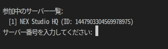
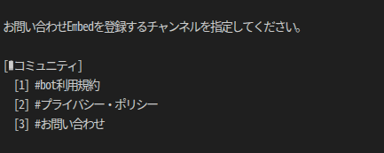

# Discord チケットBot

オープンソースで使えるDiscordのチケットBotです。

> ## このBotは一つのサーバーで運用することを想定して設計されています。

## 導入方法

まず[DiscordDeveroper](https://discord.com/developers/applications) アプリを作成して、**oauth2**タブから[Bot.Admin]の権限を選択してOauthリンクを発行して導入したいDiscordサーバーにBotを追加して下さい。

Botの作成と導入が完了したら [リリース](https://github.com/dev-Kanade/Discord-ticket-Bot)からBotの最新リリースをダウンロードしてください。

その後は表示されるウェザードに従ってセットアップを進めてください。

